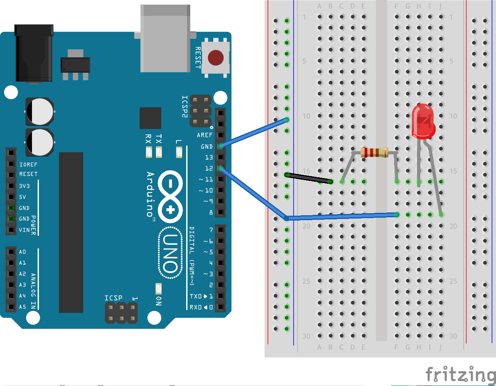

# Blinky Light Tutorial
Exactly what it sounds like - makes an LED connected to the arduino blink - oh yeah!

## Materials
- Arduino
- LED
- 220 Ohm Resistor
- Wires
- Breadboard

## Sketch




<a href="blinky_light_sketch"></a>

## Code

```
void setup() {
	pinMode(LED_pin, OUTPUT);
}
void loop() {
	digitalWrite();
}
```
